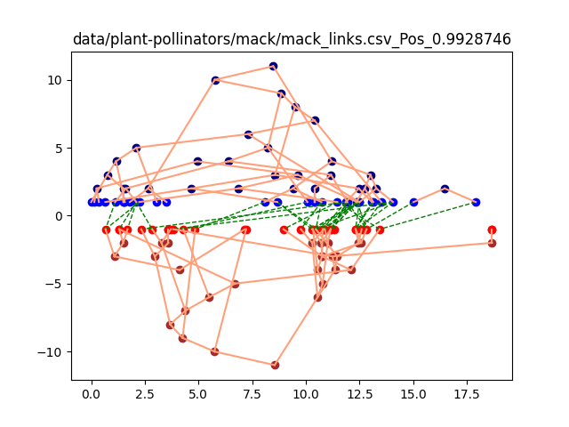
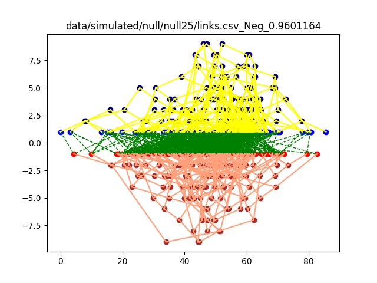

# BioTreeMatchingNN

# Setup
 Note: Current env tested on Mac M2
 
```shell
    conda env create -f mac_arm64_env.yml
    conda activate btx
```
## Data:

    Download the data folder at https://github.com/ryneches/SuchTree/ and copy to current folder

## Test run:

    python3 training.py

## Visualize
    
    python3 visualize.py -l {0 for positive, 1 for negative}
## Todo: Current visualization can be fine-tuned by some heuristic rules for better alignment


   - Upper: Host
   - Lower: Guest
