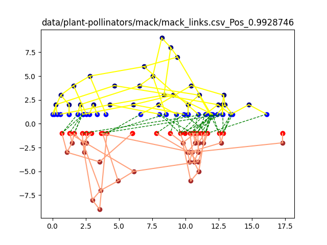

# BioTreeMatchingNN

# Setup

```shell
    conda env create -f envx.yml
    conda activate btm
```
## Data:

    Download the data folder at https://github.com/ryneches/SuchTree/ and copy to current folder

## Test run:

    python3 training.py

## Visualize
    
    python3 visualize.py -l {0 for positive, 1 for negative}
    

   - Blue: Host, OrangeRed: Guest
   - darker: leaf, lighter: closer to root
   - Area with mixing colors: highly correlated
